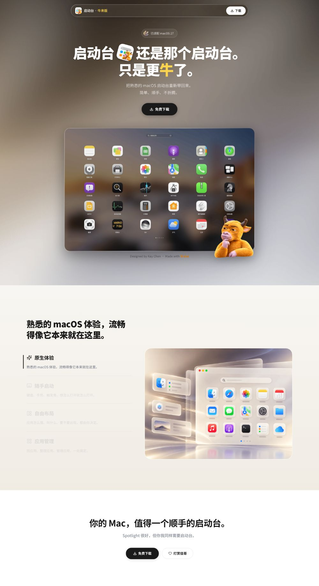

# 🐂 启动台 · 牛来版

**启动台，还是那个启动台，只是更牛了。**

把熟悉的 macOS 启动台重新带回来。简单、顺手、不折腾。

---

## ✨ 预览

  

> 右下角的思考牛，hover 会挠头哦 🤔

---

## 🚀 在线访问

官网已部署至 Cloudflare Pages（项目名：`launchpad-niulai`）和 GitHub Pages。

**👉 [https://lp.niulai.qd.je/](https://lp.niulai.qd.je/)**

---

## 📦 下载安装

| 版本 | 下载 |
|------|------|
| v1.7.11 Universal | [启动台-1.7.11-universal.dmg](启动台-1.7.11-universal.dmg) |

Universal 安装包同时适用于 Apple Silicon 和 Intel Mac。

下载后双击 `.dmg`，将「启动台」拖入 Applications 即可。

---

## 💡 特性

- **原汁原味** — 熟悉的 macOS 启动台交互，图标排列、搜索、翻页全部保留
- **Liquid Glass** — 顶部导航采用毛玻璃折射效果，通透灵动
- **思考牛彩蛋** — 右下角思考牛，hover 触发挠头帧动画
- **响应式适配** — 桌面端 / 移动端均有优化体验
- **已适配 macOS 27** — 最新系统兼容

---

## ☁️ 更新部署

将 `index.html`、`assets/`、`_headers` 和对应版本的 `.dmg` 打包上传到 Cloudflare Pages 的 `launchpad-niulai` 项目。更新版本时同步修改三个下载链接、`handleDownload()` 和 `_headers` 中的文件名。

默认地址：https://launchpad-niulai.pages.dev/

DigitalPlat DNS：`lp` 的 CNAME 指向 `launchpad-niulai.pages.dev.`，TTL 为 300 秒。

## 🛠 技术栈

- 纯 HTML / CSS / JavaScript，零框架依赖
- Liquid Glass 效果：[@real-human/liquid-glass](https://www.npmjs.com/package/@real-human/liquid-glass)
- 部署：Cloudflare Pages、GitHub Pages

---

Designed by Kay Chen · Made with Niulai 🐂

